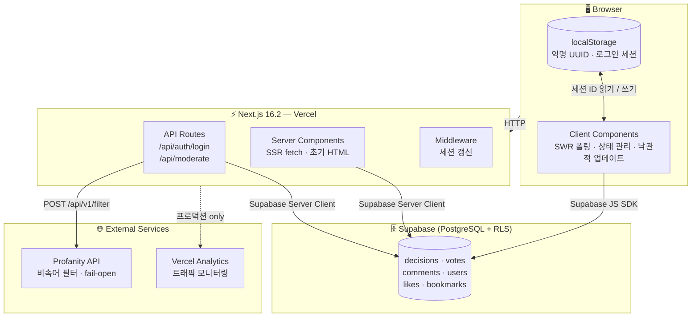

# 대신 결정해 줘! 🎯

> 로그인 없이 누구나 익명으로 A/B 투표를 올리고, 투표하고, 댓글로 의견을 나누는 결정 도우미 앱

---

## 기획 배경

일상에서 흔히 겪는 "결정 장애" 상황을 가볍게 해소하기 위해 만든 앱입니다.  
회원가입 없이 즉시 참여할 수 있는 익명 구조를 기반으로 하되, 이름+비밀번호 로그인을 통해 여러 기기에서도 동일한 세션을 유지할 수 있습니다.

---

## 주요 기능

| 기능 | 설명 |
|---|---|
| A/B 투표 생성 | 제목·설명·선택지 2개·카테고리·마감 시간 설정 |
| 익명 참여 | localStorage UUID로 즉시 참여, 로그인 불필요 |
| 로그인 세션 | 이름+비밀번호 기반 로그인으로 기기 간 세션 동기화 |
| 카테고리 필터 | 음식·패션·여가·공부·연애·스포츠·친구·기타 |
| 투표 마감 | 자동 만료(deadline) + 작성자 수동 마감 |
| 투표 트렌드 차트 | 30분 단위 누적 투표 변화율 시각화 (Recharts) |
| 댓글 | 작성/삭제, 5초 폴링 실시간 갱신 |
| 좋아요 / 즐겨찾기 | 게시글에 좋아요·즐겨찾기 토글 |
| 마이페이지 | 내 글 / 즐겨찾기 / 좋아요 필터 조회 |
| TOP 3 팝업 | 누적 투표수 상위 3개 게시글 플로팅 버튼 |
| 커스텀 이미지 | 로고·히어로 아이콘·배경 이미지 PNG 교체 지원 |
| 비속어 필터 | 외부 Profanity API 연동, 실패 시 무조건 통과(fail-open) |

---

## 기술 스택

```
Next.js 16.2 (App Router)   — 서버/클라이언트 컴포넌트 혼용
TypeScript 5.7              — 전체 타입 안전성
Supabase (PostgreSQL + RLS) — DB · 인증 없는 공개 정책
Tailwind CSS v4             — 유틸리티 CSS
shadcn/ui (Radix UI)        — 접근성 보장 헤드리스 컴포넌트
SWR                         — 클라이언트 데이터 폴링
Recharts                    — 투표 트렌드 차트
bcryptjs                    — 비밀번호 해싱 (salt rounds: 10)
sonner                      — 토스트 알림
Vercel Analytics            — 프로덕션 트래픽 분석
Vitest + Testing Library    — 단위·API·컴포넌트 테스트 (82개)
pnpm                        — 패키지 매니저
```

---

## 아키텍처 개요



### 레이어별 역할

```
┌─────────────────────────────────────────────────────────────┐
│                        Browser                              │
│  localStorage                                               │
│  ├── decide-for-me-session-id  (익명 UUID)                  │
│  └── decide-for-me-auth        (로그인 시 { sessionId, username }) │
└───────────────────────┬─────────────────────────────────────┘
                        │ HTTP
┌───────────────────────▼─────────────────────────────────────┐
│                   Next.js App Router                        │
│                                                             │
│  Server Components         Client Components                │
│  ├── app/page.tsx          ├── components/decision-card.tsx │
│  ├── app/decision/[id]/    ├── components/decision-list.tsx │
│  │   page.tsx              ├── components/comment-section   │
│  └── app/mypage/page.tsx   ├── components/vote-chart.tsx    │
│                            └── components/top3-popup.tsx    │
│                                                             │
│  API Route Handlers                                         │
│  ├── app/api/auth/login/route.ts  (로그인·자동 회원가입)    │
│  └── app/api/moderate/route.ts    (비속어 필터)             │
│                                                             │
│  middleware.ts  (Supabase 세션 갱신)                        │
└───────────────────────┬─────────────────────────────────────┘
                        │ Supabase JS SDK
┌───────────────────────▼─────────────────────────────────────┐
│                   Supabase (PostgreSQL)                     │
│  decisions  votes  comments  users  likes  bookmarks        │
│  RLS: 전 작업 허용 (무인증 공개 앱)                          │
└─────────────────────────────────────────────────────────────┘
```

---

## 세션 관리 설계

### 익명 세션 (로그인 없음)
```
첫 방문 → crypto.randomUUID() 생성 → localStorage 저장
재방문 → localStorage에서 UUID 읽기
```
- 기기가 달라지면 다른 세션 → 소유권 불일치

### 로그인 세션 (이름 + 비밀번호)
```
로그인 → POST /api/auth/login
         ├── 신규: bcrypt.hash(pw) → users 테이블 INSERT → UUID 발급
         └── 기존: bcrypt.compare(pw, hash) → 기존 UUID 반환
결과 → localStorage에 { sessionId, username } 저장
```
- 어떤 기기에서든 같은 이름+비밀번호 → 동일 UUID → 내 글·투표 소유권 유지

### 소유권 판별 로직
```ts
// 기존 글(author_session_id = null)은 누구나 관리 가능 (레거시 호환)
const isAuthor = !decision.author_session_id || decision.author_session_id === sessionId
```

---

## DB 스키마

### decisions
| 컬럼 | 타입 | 설명 |
|---|---|---|
| id | UUID PK | 자동 생성 |
| title | TEXT NOT NULL | 제목 |
| description | TEXT | 설명 (nullable) |
| option_a / option_b | TEXT NOT NULL | 선택지 |
| category | TEXT | 기본값 '기타' |
| votes_a / votes_b | INT | 득표수 |
| is_closed | BOOLEAN | 수동 마감 여부 |
| deadline | TIMESTAMPTZ | 자동 마감 시각 (nullable) |
| author_session_id | TEXT | 작성자 세션 ID (nullable) |

### votes
| 컬럼 | 타입 | 설명 |
|---|---|---|
| decision_id + session_id | UNIQUE | 세션당 1표 제한 |
| selected_option | TEXT | 'A' 또는 'B' |

### comments
- `session_id` 일치 여부로 삭제 권한 판별

### users
- `username` UNIQUE, `password_hash` (bcrypt)

### likes / bookmarks
- `UNIQUE(decision_id, session_id)` — 중복 방지

---

## 데이터 흐름 — 투표

```
사용자 클릭
  └─→ getSessionId()  (localStorage or auth UUID)
       └─→ Supabase INSERT votes(decision_id, session_id, selected_option)
            ├── 성공: 로컬 상태 낙관적 업데이트 (votes_a/B++)
            └── 에러 23505: "이미 투표하셨습니다!" 토스트
```

---

## 마감 판정

```ts
const isExpired = deadline ? new Date(deadline) < new Date() : false
const isClosed  = decision.is_closed || isExpired
```
- 클라이언트에서 1초 인터벌로 실시간 체크
- 마감 후: 투표 버튼 비활성화, 득표율(%) + 승리 옵션 하이라이트 표시

---

## SWR 폴링 주기

| 데이터 | 주기 |
|---|---|
| 게시글 목록 | 10초 |
| 댓글 | 5초 |
| 투표 트렌드 차트 | 30초 |

---

## 커스텀 이미지 교체

`public/images/` 폴더에 아래 파일명으로 PNG를 넣으면 자동 반영됩니다:

| 파일명 | 적용 위치 |
|---|---|
| `logo.png` | 헤더 로고 |
| `hero-icon.png` | 홈 히어로 아이콘 |
| `background.png` | 전체 배경 (블러 처리) |

이미지가 없으면 기본 아이콘(Phosphor Icons)으로 폴백됩니다.

---

## 프로젝트 구조

```
animal_league/
├── app/
│   ├── page.tsx                    # 홈 (Server Component)
│   ├── new/page.tsx                # 결정 생성 폼 (Client)
│   ├── mypage/page.tsx             # 마이페이지 (Client)
│   ├── decision/[id]/
│   │   ├── page.tsx                # 상세 SSR fetch (Server)
│   │   └── decision-detail.tsx     # 상세 UI + 상호작용 (Client)
│   └── api/
│       ├── auth/login/route.ts     # 로그인 API
│       └── moderate/route.ts       # 비속어 필터 API
├── components/
│   ├── auth-provider.tsx           # 전역 로그인 상태 Context
│   ├── login-modal.tsx             # 로그인 모달 (전체화면 오버레이)
│   ├── decision-card.tsx           # 카드 + 인라인 투표
│   ├── decision-list.tsx           # 목록 + 카테고리 필터 (SWR)
│   ├── decision-detail.tsx         # 상세 페이지 UI
│   ├── vote-chart.tsx              # 30분 단위 트렌드 차트
│   ├── comment-section.tsx         # 댓글 목록 + 작성 폼
│   ├── top3-popup.tsx              # TOP 3 플로팅 팝업
│   ├── background-image.tsx        # 배경 이미지 (블러)
│   ├── hero-icon.tsx               # 히어로 아이콘
│   ├── header.tsx                  # 헤더 (로고 + 인증 상태)
│   └── category-filter.tsx         # 카테고리 필터 버튼
├── lib/
│   ├── types.ts                    # 공통 타입 & 상수
│   ├── auth.ts                     # 로그인 세션 유틸
│   ├── session.ts                  # 세션 ID 조회
│   ├── vote-utils.ts               # 순수 함수 (퍼센트, 시간 포맷)
│   ├── chart-utils.ts              # 차트 데이터 빌더
│   └── supabase/
│       ├── client.ts               # 브라우저용 Supabase 클라이언트
│       └── server.ts               # 서버용 Supabase 클라이언트
├── __tests__/
│   ├── unit/                       # vote-utils, chart-utils, session, auth, types
│   ├── api/                        # auth/login, moderate
│   └── components/                 # DecisionCard, LoginModal, CategoryFilter
├── scripts/                        # DB 마이그레이션 SQL (001 ~ 009)
└── public/images/                  # 커스텀 이미지 교체 폴더
```

---

## 개발 환경 설정

### 1. 환경 변수

`.env.local` 파일 생성:

```env
NEXT_PUBLIC_SUPABASE_URL=https://xxxx.supabase.co
NEXT_PUBLIC_SUPABASE_ANON_KEY=eyJ...
PROFANITY_API_URL=https://your-profanity-api.com   # 선택사항
PROFANITY_API_KEY=your-api-key                     # 선택사항
```

### 2. DB 마이그레이션

`scripts/` 폴더의 SQL 파일을 Supabase SQL Editor에서 순서대로 실행:

```
001_create_tables.sql
002_add_category.sql
003_fix_rls.sql
004_fix_votes_comments_rls.sql
005_add_deadline.sql
006_fix_schema_mismatch.sql
007_add_author_session_id.sql
008_add_users_table.sql
009_add_likes_bookmarks.sql
```

### 3. 개발 서버 실행

```bash
pnpm install
pnpm dev
```

---

## 개발 명령어

```bash
pnpm dev            # 개발 서버 (http://localhost:3000)
pnpm build          # 프로덕션 빌드
pnpm lint           # ESLint 검사
pnpm test           # 테스트 실행 (82개)
pnpm test:watch     # 테스트 watch 모드
pnpm test:coverage  # 커버리지 리포트
```

---

## 테스트 구조

총 **82개 테스트**, 전체 통과 기준:

```
__tests__/
├── unit/
│   ├── vote-utils.test.ts     # calcPercent, formatRemainingTime, getTimeAgo
│   ├── chart-utils.test.ts    # buildChartData 버킷 로직
│   ├── session.test.ts        # getSessionId (localStorage mock)
│   ├── auth.test.ts           # getAuth, setAuth, clearAuth
│   └── types.test.ts          # CATEGORIES, DEADLINE_OPTIONS 상수
├── api/
│   ├── auth-login.test.ts     # 신규/기존 유저, 비밀번호 검증, 400/401/500
│   └── moderate.test.ts       # fail-open 동작, 비속어 탐지, 네트워크 오류
└── components/
    ├── decision-card.test.tsx  # 렌더링, 마감 배지, 퍼센트, deadline 표시
    ├── login-modal.test.tsx    # 폼 유효성, API 호출
    └── category-filter.test.tsx
```

---

## 배포

Vercel에 연결된 저장소로 `main` 브랜치 머지 시 자동 배포됩니다.  
Vercel Analytics가 프로덕션 환경에서만 활성화됩니다.
